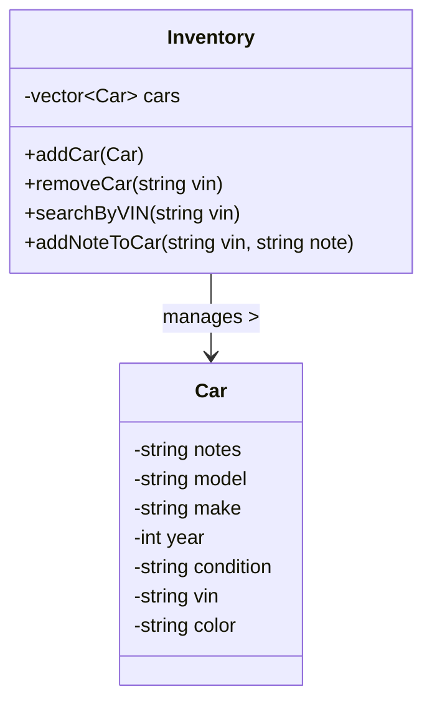

# 🚗 Car Inventor App

A simple yet powerful application to manage a collection of cars — add, remove, search, and leave notes.

---

## Nouns

### `Car`
- `notes` : string
- `model` : string
- `make` : string
- `year` : int
- `condition` : string
- `vin` : string
- `color` : string

### `Inventory`
- A collection of `Car` objects.

---

## 🔧 Verbs (App Features)
- `add car`
- `remove car`
- `search`
- `add note`

---

## 📦 C++ Class Interfaces

```cpp
class Car {
private:
    std::string notes;
    std::string model;
    std::string make;
    int year;
    std::string condition;
    std::string vin;
    std::string color;

public:
    // Getters and setters can be added as needed
};

class Inventory {
private:
    std::vector<Car> cars;

public:
    void addCar(const Car& car);
    void removeCar(const std::string& vin);
    Car* searchByVIN(const std::string& vin);
    void addNoteToCar(const std::string& vin, const std::string& note);
};
```

---

## 🕸️ Mermaid Class Diagram



---

## 📝 Summary

This app provides a streamlined experience for managing your automobile collection or dealership records.
